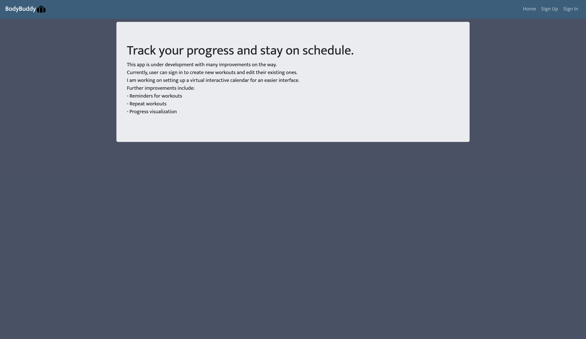
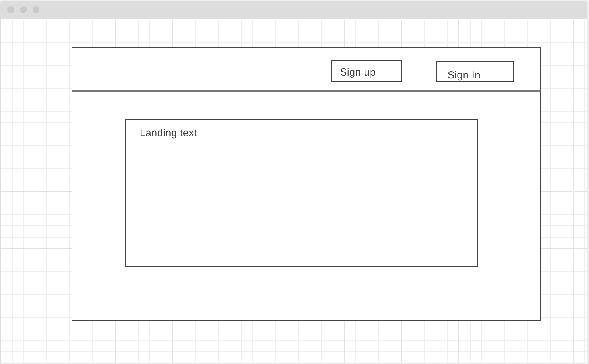
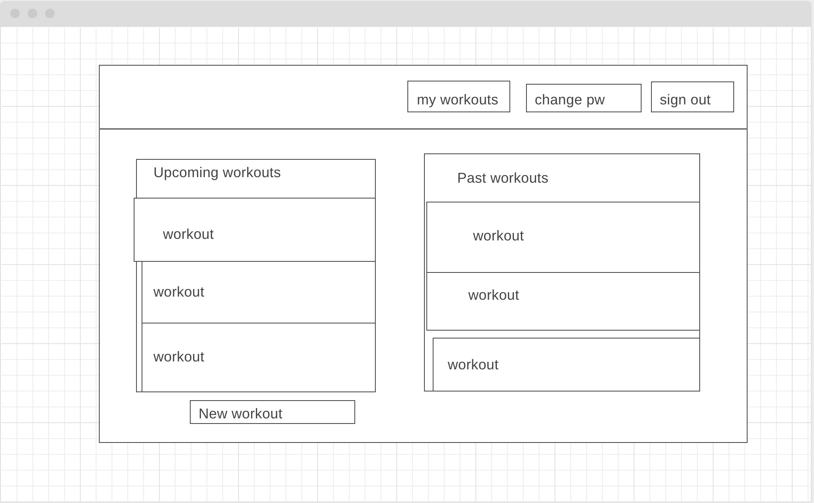

[App name] is an app intended for users to create and manage their workout routines. Users can create, edit, and delete their workouts, view all workouts, and view individual workouts.

[Deployed App](https://mctripp.github.io/workout-tracker-client/#/)
[Deployed Backend](https://workout-tracker-express-api.herokuapp.com/)
[Workout Tracker Express API (backend)](https://github.com/Mctripp/workout-tracker-express-api)

## Tech Used
- [React.js](https://reactjs.org/)
- [Bootstrap](https://getbootstrap.com/) for React
- [Moment.js](https://momentjs.com/) - A library of functions and methods to simplify handling date and time

## Screenshot

## Wireframe

### Unauthorized:

### Authorized:

## User Stories
Users should be able to:
- Sign up, in, out, and change their password
- Create, edit, and delete a workout
- View a list of all workouts

Stretch:
- Set account preferences
- Mark a workout as completed
- Set a reminder on a workout
- Set a workout to be repeated on certain days
- Edit multiple instances of a single workout with one change
- Follow other people using the app
- See a feed of other peoples' progress
- View someone's profile

## Planning & Process
I started with the backend on this project, setting up my resources and going over a couple iterations of which properties I thought were necessary. I deployed to heroku and moved to work on my front end. I had not used React much before, so most of the app was a learning process. I tried to keep it simple overall, but ended up going with some Modals and Accordions since they fit the way I wanted to display the app data.

## Unsolved Problems
Unsolved issues are, apart from the stretch user stories, removing a warning related to the entered date's format, figuring out a 3rd party calendar app to use on the site for visual organization, and making the site navigation more fluid (including adding some loading text/pages).
